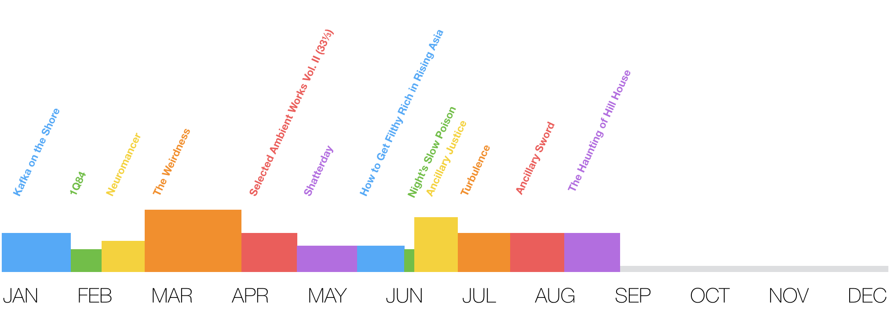

# Goodreads Year in Reading Chart

An idea.

- a year split up by sections that represent books read
- the length of the sections corresponds to the duration of reading
- the height of the sections corresponds to the page-length of the book

It would look something like this:

